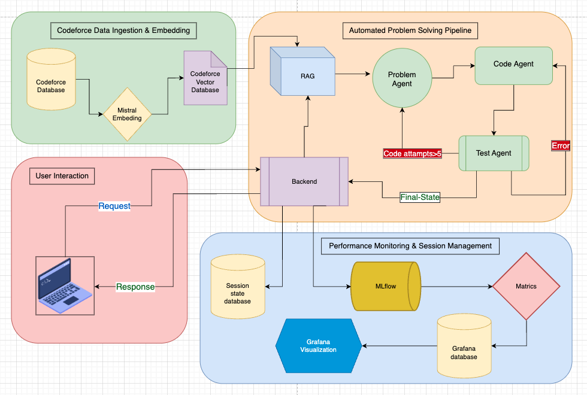
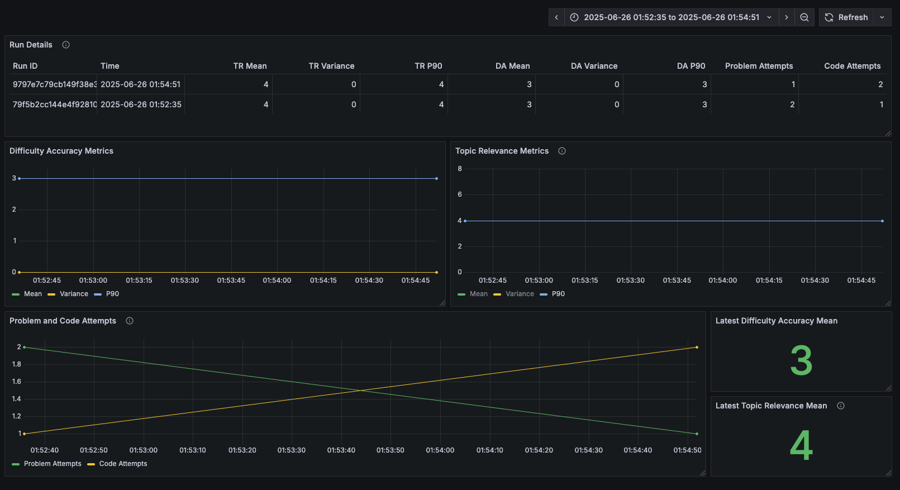

# LevelUp: AI-Powered Technical Interview Platform

LevelUp streamlines the technical interview process by using generative AI to create unique, topic-specific problems at varying difficulty levels. This addresses the challenge of candidates rehearsing common interview questions, providing a more effective and reliable evaluation of their true problem-solving abilities.

## 🚀 The Problem

The current technical recruitment process is highly predictable. Candidates often memorize solutions to common interview questions, which hinders a hiring manager's ability to assess their actual problem-solving skills. Additionally, creating unique and relevant questions for each candidate is a time-consuming and difficult task for interviewers to scale.

## ✨ Our Solution

LevelUp offers a web-based solution that generates complete and unique problem statements with a single click. The platform takes parameters like the desired topic (e.g., "Graph Theory") and difficulty level (e.g., "Medium") to produce a well-structured problem that includes a description, constraints, and sample inputs/outputs.

This is achieved using a Retrieval Augmented Generation (RAG) model that combines keyword and semantic search to retrieve relevant existing problems, which are then used by a Large Language Model (LLM) to generate a new, unique problem.

## Key Features for Hiring

-   **Improve Assessment Quality**: Evaluate candidates on their problem-solving skills, not their memorization abilities.
-   **Save Interviewer Time**: Instantly generate unique problems, significantly reducing preparation time for interviews.
-   **Ensure Fairness**: Provide standardized yet unique challenges for each candidate, ensuring a fair and consistent evaluation process.
-   **Customizable Content**: Tailor problems to specific topics and difficulty levels to match the requirements of the role.

## 👥 Target Audience

Our primary customers and stakeholders include:
-   Technical Interviewers
-   Hiring Managers
-   Lead Engineers

## 🏛️ System Architecture

The LevelUp platform is built on a robust and scalable machine learning system architecture:



1.  **User Interface**: A simple and intuitive web-based interface where users can input their desired problem parameters.
2.  **Backend API Layer**: A FastAPI-based backend that handles user requests and orchestrates the problem generation workflow.
3.  **Data Ingestion**: A scraper ingests problems from sources like Codeforces. This data is then preprocessed and stored.
4.  **Metadata and Vector Storage**: Problem metadata is stored in a PostgreSQL database, while problem embeddings are stored in a Vector Database for efficient semantic retrieval.
5.  **RAG and LLM Pipeline**:
    * An **Embedding Generator** (e.g., OpenAI, MiniLM) creates vector embeddings of the problems.
    * The **RAG Retriever** finds relevant problems from the vector database based on the user's query.
    * A **Prompt Generator** creates a prompt for the LLM based on the retrieved problems.
    * The **LLM** generates a unique problem based on the provided topic and style.
6.  **Evaluation and Monitoring**: User feedback is collected and stored in an evaluation and tracing database to monitor performance and improve the system. A separate LLM is used to verify the output of the main LLM, ensuring the quality of the generated problems.

## 🛠️ Tech Stack

-   **Backend**: FastAPI
-   **Databases**: PostgreSQL (for metadata), Vector Database (for embeddings)
-   **ML Models**:
    -   **Embedding Model**: OpenAI, MiniLM, or similar
    -   **Generator Model (LLM)**
-   **ML Approach**: Retrieval Augmented Generation (RAG)
-   **Data Source**: Hugging Face dataset `evanellis/codeforces_with_only_correct_completions`

## 📊 Performance Monitoring & Analytics

LevelUp incorporates comprehensive monitoring and analytics capabilities to ensure optimal system performance and user experience. Our monitoring infrastructure provides real-time insights into system metrics, model performance, and user interaction patterns.



### Key Monitoring Metrics:

- **Difficulty Accuracy Metrics**: Track how well the system generates problems at the requested difficulty levels
- **Topic Relevance Metrics**: Monitor the relevance of generated problems to specified topics
- **Problem and Code Attempts**: Analyze user engagement and problem-solving patterns
- **System Performance**: Real-time monitoring of response times, throughput, and error rates
- **Model Quality**: Continuous evaluation of LLM output quality and RAG retrieval effectiveness

The dashboard provides actionable insights that help optimize the platform's performance and ensure consistent delivery of high-quality interview problems.

## ⚙️ Setup and Installation

1.  **Clone the repository:**
    ```bash
    git clone [https://github.com/your-username/levelup.git](https://github.com/your-username/levelup.git)
    cd levelup
    ```

2.  **Create and activate a virtual environment:**
    ```bash
    python -m venv venv
    source venv/bin/activate
    ```

3.  **Install the dependencies:**
    ```bash
    pip install -r requirements.txt
    ```

4.  **Set up environment variables:**
    -   Create a `.env` file in the root directory.
    -   Add the necessary API keys and configuration variables for your LLM and database connections.

## 🚀 How to Run

1.  **Run the data pipeline (if necessary):**
    -   To populate the vector database with initial problems, execute the data ingestion and embedding generation scripts.
    ```bash
    python pipelines/training_pipeline.py
    ```

2.  **Start the Flask application:**
    ```bash
    python app/main.py
    ```

3.  **Access the application:**
    -   Open your web browser and navigate to `http://127.0.0.1:5000`.

## ✅ Validation

To validate the effectiveness of our solution, we plan to conduct a beta program with hiring managers, allowing them to use the generated problems in live interviews and provide valuable feedback.

## 🤝 Contribution

We welcome contributions to the LevelUp project! If you have ideas for new features, improvements, or bug fixes, please feel free to open an issue or submit a pull request.
